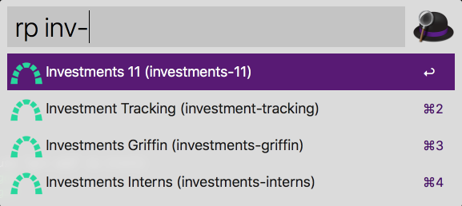

# Fast Fuzzy Redmine Projects

Alfred plugin to retrieve your own Github repositories fuzzy and fast.

Written in JavaScript with [alfy](https://github.com/sindresorhus/alfy).



## Installation

```
npm install --global @renuo/alfred-fast-fuzzy-redmine-projects --@renuo:registry=https://npm.pkg.github.com
```

## Actions

The idea is that you manually sync down your Redmine project list.
This allows the search to always perform on local data.

* `rp-token <token>`
  Set's up the Redmine token authorization. You can find your token
  in your Redmine account settings.
* `rp-host <host>`
  Set's up the Redmine host.
* `rp-sync`
  Downloads the projects list over the Redmine REST API.
* `rp <fuzzy project>`
  Fuzzily searches the local copy of your projects list for project's `name` and `identifier`.

## Development

```
npm install
npx alfred-link
```

## License

[MIT License](./LICENSE)
